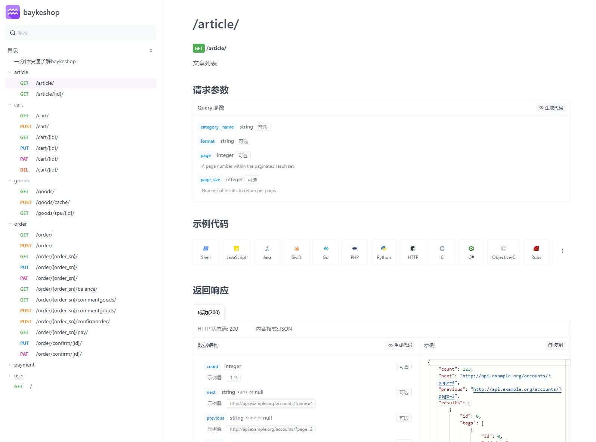

# BaykeShop（拜客商城系统）

For full documentation visit [bayke.shop（拜客商城系统）](http://www.bayke.shop).

## 项目简介
baykeshop（拜客商城系统）是一款全开源Python栈商城系统，采用最新版django4以上版本开发，代码精炼简洁易于学习及二次开发。

### 介绍
本项目支持前后端分离开发，完全采用django-restframework开发，PC端采用drf提供的TemplateHTMLRenderer渲染器对接口视图继承并渲染，真正做到了，一套接口PC和移动端公用的效果！


### 项目特色

更符合国人使用和学习的Python django开源商城项目，没有复杂的语法和过渡的封装，一切符合django的使用方式！

1、后台定制默认admin,支持动态菜单，兼容三方皮肤（如：django-simpleui）

2、完整的多规格商品逻辑，支持商品SPU和SKU及规格关系

3、支持余额支付、微信支付（开发中）、支付宝支付，配置简单收款便捷

4、凭借django强大的加持，可轻松配置多数据库Mysql/Sqlite3等

5、独立配置文件，通过简单的配置修改可控制全局相关功能

6、本项目设计并开放了标准的RestFull api接口【 **接口文档请在文末查看获取** 】

## 演示
- [演示地址-demo.bayke.shop](http://demo.bayke.shop)
> 如有更深层次使用需求，请按照快速上手拉取到本地测试，快速上手为主分支创建说明！

## 快速上手

### 1、克隆项目源码
```
git clone https://gitee.com/bayke/bayke-shop.git
```
### 2、创建虚拟环境
```
cd bayke-shop
python3 -m venv venv
```
### 3、激活虚拟环境
```
Windows: venv\Scripts\activate
Liunx: source venv/bin/activate
```
### 4、安装依赖
```
pip install -r requirements.txt
```
### 5、配置Mysql数据库

> 项目默认配置了Mysql数据库和redis缓存，需要你自行在运行项目前，配置安装好Mysql数据库及redis！

- 配置Mysql数据库
项目根目录有个mysql.cnf的文件，修改其中的数据库信息为你自己的！
```
[client]
database = baykedb  # 数据库名
user = root         # 用户名
password = 123456   # 用户密码
host = 127.0.0.1
port = 3306
default-character-set = utf8
```

### 6、同步数据库
```bash
python manage.py makemigrations
python manage.py migrate
```
### 7、创建超级管理员
```python
python manage.py createsuperuser

# 输出格式如下
# 用户名 (leave blank to use 'qbc'): admin
# 电子邮件地址: admin@qq.com
# Password: 
# Password (again): 
# Superuser created successfully.
```
### 8、初始化项目
```python
# 创建后台自定义菜单
python manage.py create_menu

# 如需要生成演示数据，运行以下命令
python manage.py create_test
```

### 9、运行项目
```
python3 manage.py runserver
```
### 10、查看项目
```
前台：http://127.0.0.1:8000
后台：http://127.0.0.1:8000/admin/

后台账号及密码是你在第五步创建的！
```

### 11、支付宝配置

虽然你可以通过修改baykeshop/conf/defaults.py中的默认配置来控制全局相关设置，但我不建议你这么做，这个配置文件作为默认选项的回退，尽量不要去修改，而是在项目bayke目录下的settings.py中覆盖默认项配置！
```python
# bayke/settings.py

BAYKE_SHOP = {
    "ALIPAY_PRIVATE_KEY": "应用私钥pem路径",
    "ALIPAY_PUBLIC_KEY": "支付宝公钥pem路径",
    "ALIPAY_APPID": "支付宝APPID",
    "ALIPAY_SIGN_TYPE": "加密方式，默认是RSA2",
}
```
以上就是配置支付宝收款你需要做的全部工作！


### 赞赏支持

>  **说明：** 如果本项目给您带来了一些帮助和收获，并且在您条件允许的情况下，我需要您的支持，您的一份支持才能让项目有一个良性的发展，以下是我给您赞赏一点点回报！

 **1、凡赞赏金额大于25元即可加入本项目交流群，纯净技术交流，无广告！** 

 **2、可以获取到apifox在线版接口文档以及离线版markdown接口文档！** 

 **3、作者群内互动，解答使用者在开发过程中的一些问题及技术交流！** 

 **4、凡赞赏金额大于50元，除拥有以上福利之外，将获得作者私下处理本项目问题一次并且将获得项目后期新增移动端前端源码！**  


赞赏留言请备注微信号，作者将第一时间添加发送相关资料及拉群！


