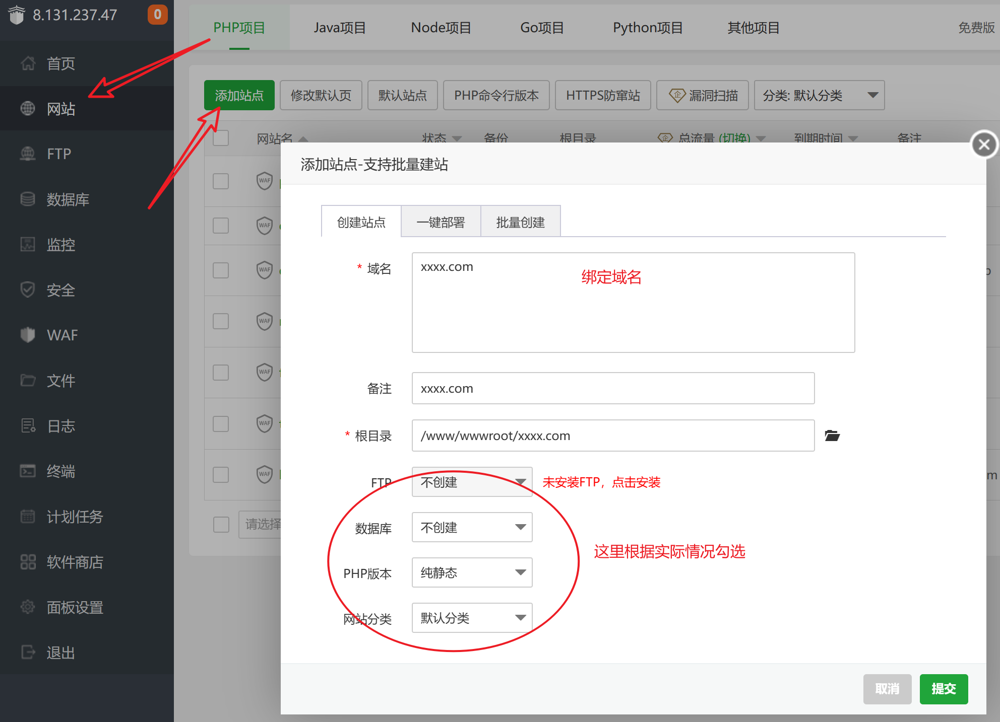
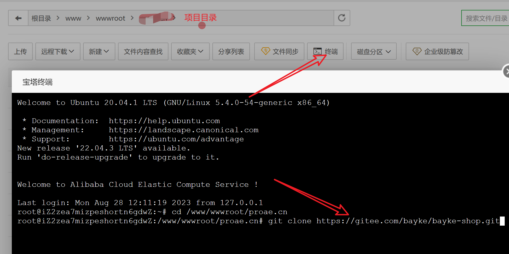
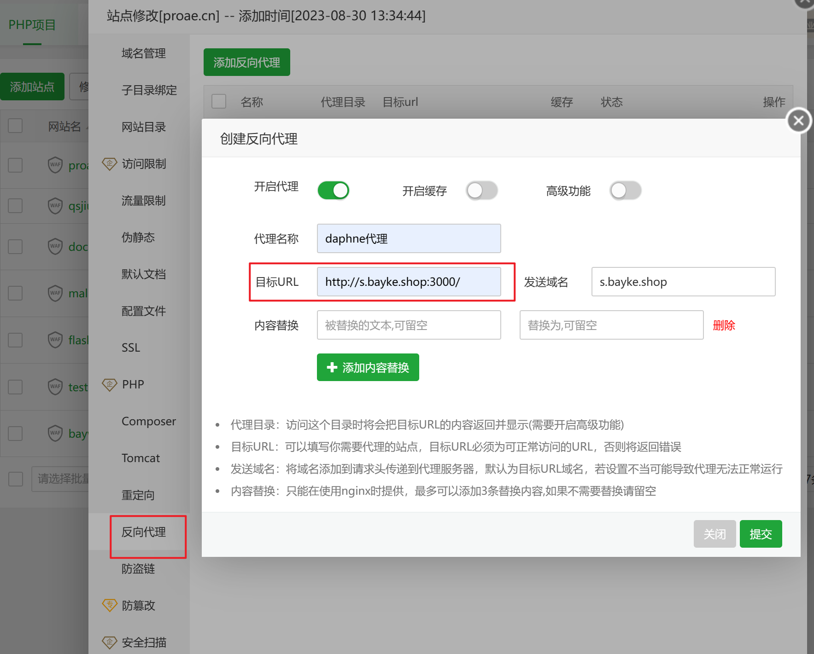
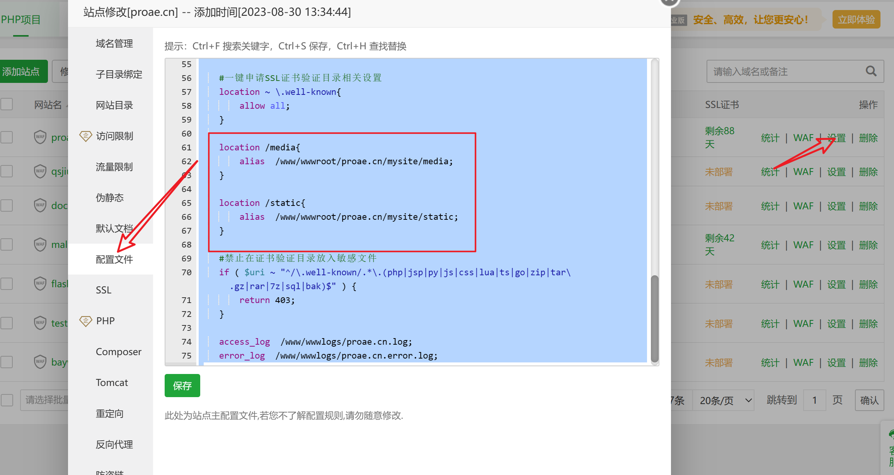

# 宝塔面板辅助部署baykeshop商城系统

本部署过程基于Nginx + daphne + supervisor三个工具包，暂未使用到MySQL和redis，如需将数据库切换为Mysql，缓存切换为redis可启用production.py配置文件，具体参考项目详细说明！

这里的宝塔面板仅仅是作为一个辅助工具来使用，当然你要启用Mysql和redis的话，宝塔面板也非常容易！

## 宝塔面板新建静态站点，并运行项目

1. 根据下图所示步骤创建一个静态站点




2. 在静态站点创建好的根目录运行终端克隆项目！




3. 参考快速上手的步骤先正确的在服务器本地运行起来：
 
参考文档： https://gitee.com/bayke/bayke-shop/blob/main/README.md


## 部署

如果你正确的按照第三步的所有步骤已经成功运行了起来项目，那么依赖环境其实已经安装了daphne和supervisor两个依赖包！

此时，我们就可以开始关注deploy目录中的文件了，首先在deploy目录中新建一个sock的空目录，用来存放临时的通信文件！

其中asgi.ini是我们要重点关注的，其中配置是我们部署项目的关键，如果你不是很懂这个配置的话尽量不要去随便修改，只需要关注这两项配置即可！

```python
# 最后的3000是项目的端口号，可根据自己实际情况填写
socket=tcp://0.0.0.0:3000

# 项目文件所在目录,也就是我们克隆下来的项目目录
directory=/www/wwwroot/s.bayke.shop/bayke-shop
```
另外需要关注的是supervisord.conf这个文件，不过没有特殊需求，无需修改任何东西！

静态文件我已经做了收集，所以如果你没有修改任何样式则无需再进行收集静态文件！

## 启动进程
```bash
supervisord -c deploy/supervisord.conf
```
没有发生意外的话，现在就可以直接使用域名+端口（3000）来访问程序了，但这样是不够的，没有人访问网站会带端口号去访问，所以，之前建立的静态站点就起到了关键作用，为静态站点配置反向代理！

- 配置反向代理



- 向Nginx的配置文件中引入django的静态文件配置以及后台前端,注意配置自己的路径



```Nginx
# 本地上传文件目录
location /media{
    alias  /www/wwwroot/s.bayke.shop/bayke-shop/media;
}

# 静态文件目录
location /static{
    alias  /www/wwwroot/s.bayke.shop/bayke-shop/static;
}

# 后台前端，因此打包后的文件必须存放到这个路径才能生效
location /baykeadmin{
    alias  /www/wwwroot/s.bayke.shop/bayke-shop/web/baykeadmin;
}
```
做完以上步骤，重载nginx配置，不出意外，已经部署成功了！

部署是一个非常复杂的过程，每个人的环境操作等不同，相同的方式也不是所有人都能部署成功，需要有一定的悟性，祝您好运！

当然，我会持续优化部署过程使其更加简便，简单！


